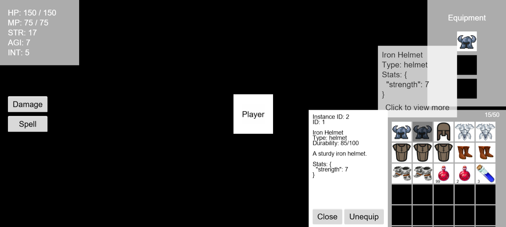

# RPG Equipment & Inventory System

A lightweight RPG system built with **Cocos Creator 3.8.6**, featuring character stats, an inventory system, equipment management, and consumable items with interactive UI feedback.

## Features

- **Character Stats**: Health, Mana, Strength, Agility, Intelligence.
- **Equipment System**: Helmet, Armour, Boots (boosts character stats when equipped).
- **Inventory Management**: Add, stack, equip, and consume items.
- **Consumable Items**: Restore Health and Mana through potions and similar items.
- **Interactive UI**:
  - Real-time stat updates.
  - VFX feedback when equipping items.
  - Tooltips showing item stats on hover and item details on click.
- **Player Interaction**: Buttons to deal damage or consume mana for testing item usage.
- **Responsive Layout**: Supports multiple landscape screen sizes and aspect ratios.

## Tech Highlights

- Built as a **Web Mobile game**.
- Uses **prefabs** for reusable UI and gameplay elements.
- **SOLID principles** applied for clean and extensible code.
- **Observer Pattern** implemented with Cocos’ built-in `EventTarget` for component communication.
- Supports **resource-driven data loading** for flexible updates.
- **Unit tests** with **Jest** for core gameplay logic features.

## Setup

1. run `npm i` in the terminal
2. Open the project in **Cocos Creator 3.8.6**.
3. Build and run on **Web Mobile** platform (can import build config file at `configs/buildConfig_web-mobile.json`).
4. Use the provided UI to interact with the character, inventory, and equipment.

## Unit test

1. run `npm run test` in the terminal.
